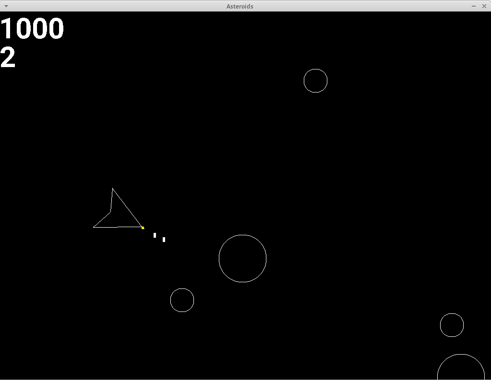

# asteroids
## Very simple clone of the classic Asteroids game

This is a very minimalistic clone of the classic Atari game from 1979.

This clone was implemented using C++ and the [SDL2](https://www.libsdl.org/) library.
For font rendering, [SDL2_ttf](https://wiki.libsdl.org/SDL2_ttf/FrontPage) along with
the [Roboto](https://fonts.google.com/specimen/Roboto) font was used.

## Screenshot



## Controls

- Firing rockets: Space
- Moving: Arrow keys
- Restarting the game (after Game Over): R
- Closing the game: Escape

## Building

Install dependencies (example for Ubuntu):
```sh
sudo apt install libsdl2-dev libsdl2-ttf-dev
```

Build the game:
```sh
make
```

Run the game:
```sh
./asteroids
```
